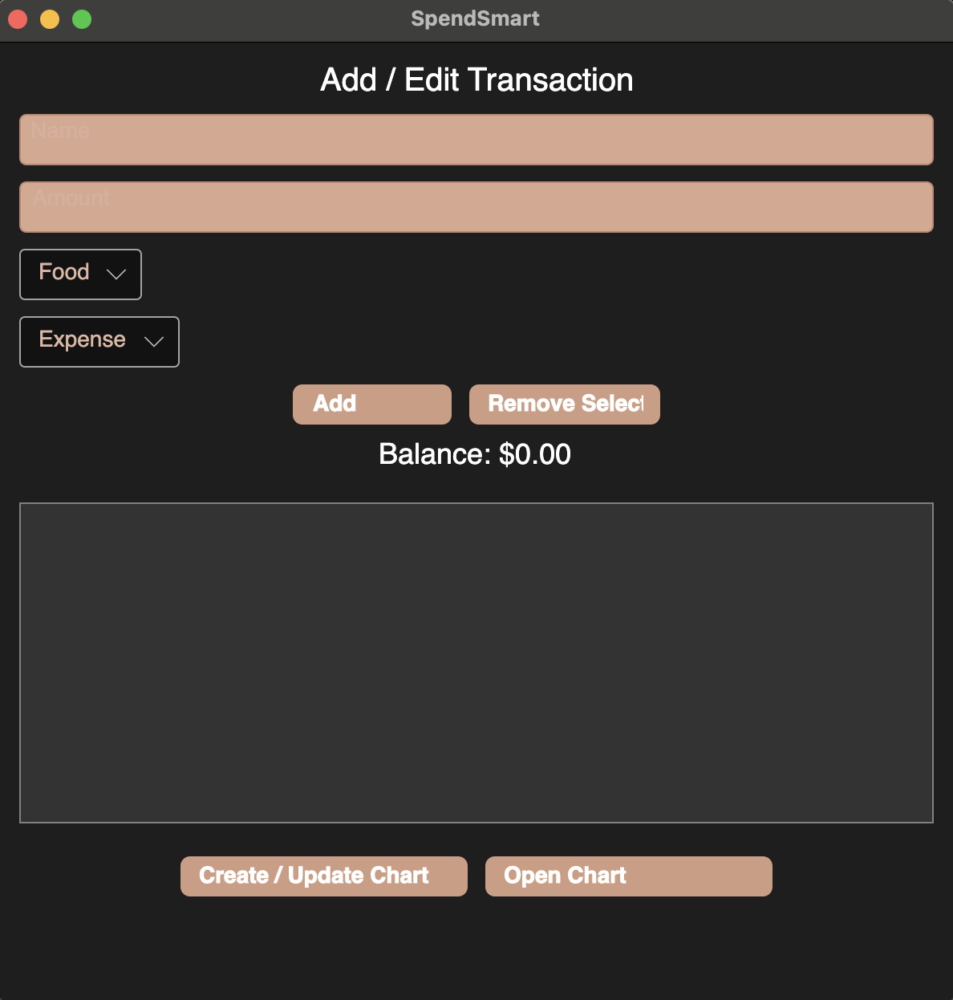
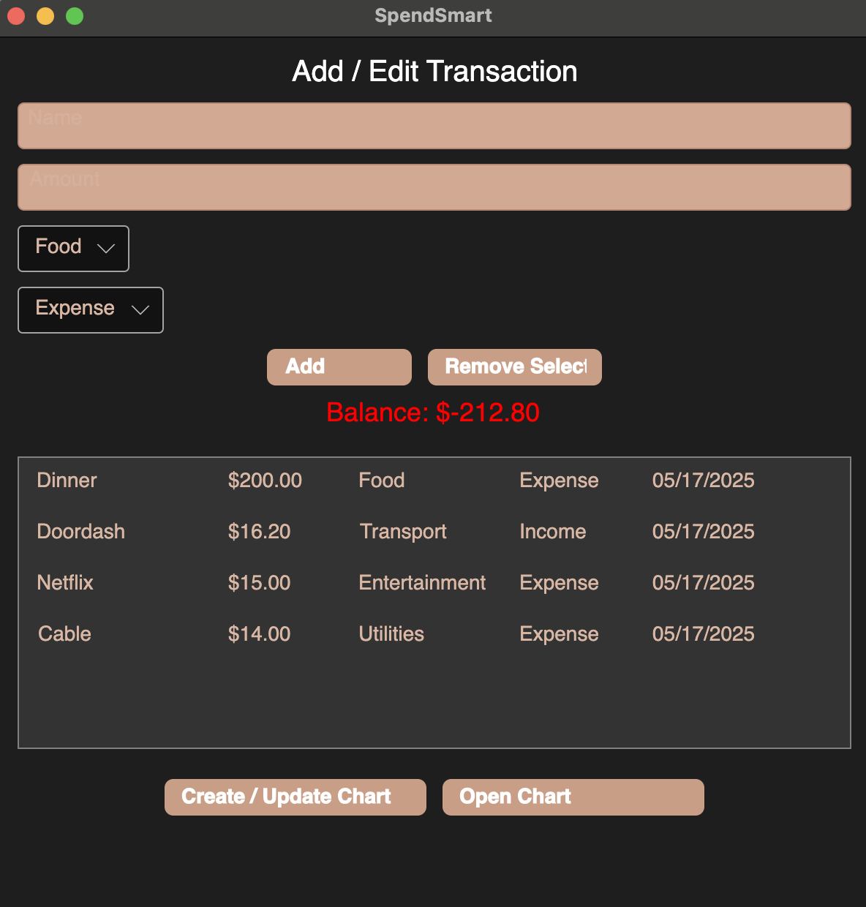
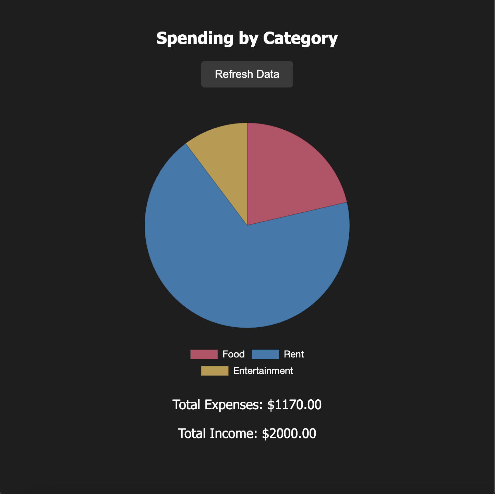

# SpendSmart 

SpendSmart is a simple Avalonia-based desktop application that helps you track your income and expenses visually using animated charts. Built with C# and HTML.

## Features

- Add transactions with categories and dates
- View animated pie charts and bar graphs
- Export reports to JSON
- Clean, modern UI

## Tech Stack

- C#
- Avalonia UI
- HTML

## How to Run

1. Clone the repo  
2. Open with your favorite C# IDE (e.g., JetBrains Rider or Visual Studio Code)  
3. Build and run the project

## Screenshots

### Main Screen

### Balance View

### Pie Chart Report

---

Made by Gracie Idonije
